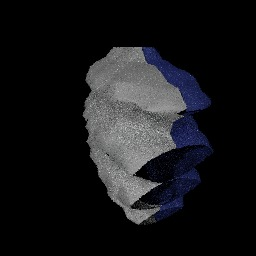
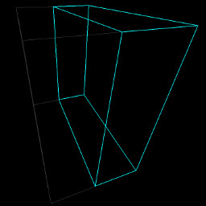

# SpRay: a distributed-memory speculative ray tracer for out-of-core and in situ rendering

Copyright (c) 2017-2018 The University of Texas at Austin. All rights reserved.

SpRay is licensed under the Apache License, Version 2.0 (the "License");
you may not use this file except in compliance with the License. A copy of the License is included with this software in the file `LICENSE`. If your copy does not contain the License, you may obtain a copy of the License at: [Apache License Version 2.0][1].
Unless required by applicable law or agreed to in writing, software distributed under the License is distributed on an "AS IS" BASIS, WITHOUT WARRANTIES OR CONDITIONS OF ANY KIND, either express or implied. See the License for the specific language governing permissions and limitations under the License.  

## Introduction

This repository contains the source code of the speculative ray scheduling technique described in the following paper:
```
SpRay: Speculative Ray Scheduling for Large Data Visualization
Hyungman Park, Donald Fussell, Paul Navrátil
IEEE Symposium on Large Data Analysis and Visualization 2018
```

It also includes our implementations of the baseline algorithm described in the following paper:
```
Exploring the Spectrum of Dynamic Scheduling Algorithms for Scalable Distributed-Memory Ray Tracing
Paul A. Navrátil, Hank Childs, Donald S. Fussell, Calvin Lin
IEEE Transactions on Visualization and Computer Graphics 2013
```

You can find our paper and slides on [the project page][4].
```
https://hyungman.bitbucket.io/projects/spray/
```

## Contributors
* Hyungman Park, ECE and TACC, UT Austin (Developer)
* Paul Navratil, TACC, UT Austin (Advisor)
* Donald Fussell, CS, UT Austin (Advisor)

## Acknowledgments
* National Science Foundation grant ACI-1339863
* An Intel Visualization Center of Excellence award through the IPCC program

## Building Spray (Linux)

Build and install [Embree][2]. Make sure your Embree installation has the `lib` directory. We tested Spray with Embree v2.17.1.

Check out Spray with all submodules.

```bash
git clone https://github.com/TACC/SpRay.git
cd SpRay
git submodule init
git submodule update
```
Or simply,

```bash
git clone --recurse-submodules https://github.com/TACC/SpRay.git
cd SpRay
```

Create a directory and build.

```bash
mkdir build
cd build
cmake -DEMBREE_INSTALL_DIR=<path_to_embree_install> ..
make
```

If you wish to install Spray,

```bash
make install
```

## Building Spray (macOS)

Install an OpenMP library. We show an example of installing `libomp` using `Homebrew`.

```bash
brew install libomp

```

Build and install [Embree][2]. Make sure your Embree installation has the `lib` directory. We tested Spray with Embree v2.17.1.

Check out Spray with all submodules.

```bash
git clone https://github.com/TACC/SpRay.git
cd SpRay
git submodule init
git submodule update
```

Or simply,

```bash
git clone --recurse-submodules https://github.com/TACC/SpRay.git
cd SpRay
```

Create a directory and build.

```bash
mkdir build
cd build
cmake -DOpenMP_INSTALL_DIR=$(brew --prefix libomp) -DEMBREE_INSTALL_DIR=<path_to_embree_install> ..
make
```

If you wish to install Spray,

```bash
make install
```

## Running Spray (Linux and macOS)

As you run the bash scripts below, you'll be asked to choose an application from a list of applications. Those starting with `base` are an implementation of the baseline algorithm; those starting with `spray` are an implementation using the speculative technique.

Notice that the scripts launch MPI tasks using the `mpirun` command and specify the number of OpenMP threads by setting the environment variable `OMP_NUM_THREADS`. You may have to modify such settings based on your system requirements.

Additionally, if you wish to use installed binaries, you'll have to modify the variable `SPRAY_BIN_PATH` in the scripts and set runtime search paths, `LD_LIBRARY_PATH` or `DYLD_LIBRARY_PATH`, as needed.

### Rendering isosurfaces of 64 wavelet domains

Set a path to the project home.

```bash
export SPRAY_HOME_PATH=<path_to_spray_home>
```

For film mode,

```bash
source $SPRAY_HOME_PATH/examples/wavelets64/wavelets64.sh film
Type a number from the application list.
display spray.ppm
```

For glfw mode,

```bash
source $SPRAY_HOME_PATH/examples/wavelets64/wavelets64.sh glfw
Type a number from the application list.
Type the q-key to close the window.
```

You should see the following as a result:


### Scene descriptions

We now explain how to create a scene file and render the scene using a simple example with two domains of isosurfaces.

If you wish to skip the next two sections, copy the example scene file and go to the section of rendering a scene of two wavelet domains. 

```bash
export SPRAY_HOME_PATH=<path_to_spray_home>
cp $SPRAY_HOME_PATH/examples/wavelet/wavelet_example.spray $SPRAY_HOME_PATH/examples/wavelet/wavelet.spray
```

#### Generating a scene file using ply files

Given ply files each associated with a domain, you can generate a scene file using the `ply_header_reader` tool and the `plyfiles_to_scene.py` script. `ply_header_reader` quickly parses only the header portion of a ply file to extract geometry information. `plyfiles_to_scene.py` takes all the ply files within a directory set by the user, and for each ply file, it uses the `ply_header_reader` tool to generate a domain section of the scene file.

The following is how you can generate `wavelet.spray` for the two ply files, `wavelet0.ply` and `wavelet1.ply`, located in `$SPRAY_HOME_PATH/examples/wavelet`.

First, set environmental variables, if you have not done so.
```bash
export SPRAY_HOME_PATH=<path_to_spray_home>
export SPRAY_BIN_PATH=<path_to_spray_executables>
```

Then, run the Python script to generate a scene file.

```bash
cd $SPRAY_HOME_PATH/scripts
python plyfiles_to_scene.py \
--loader $SPRAY_BIN_PATH/ply_header_reader \
--indir $SPRAY_HOME_PATH/examples/wavelet \
--out $SPRAY_HOME_PATH/examples/wavelet/wavelet.spray
```

If absolute paths are desired for ply files, you can simply append the `--abspath` option to the command line above.

#### Adding light sources to a scene file

With a scene file in place, you should manually add light sources somewhere in the scene file. If only ambient occlusion is used, no light sources are required so you may skip this step.

Spray currently supports two kinds of light sources: a point light source and a diffuse area light source. Depending on the light type, you can add a light source using one of the following two lines.

```
light point <position x y z> <intensity r g b>
light diffuse <intensity r g b>
```

Each line with the `light` identifier is considered an independent light source in the scene file. For example, with the following statements in the scene file, Spray will create a point light source and a diffuse light source upon loading the scene file.

```
light point -20 20 20 .2 .2 .2  
light diffuse .1 .1 .1
```

The `diffuse` identifier defines a diffuse area light source that emits radiance uniformly over the hemisphere around the surface normal at each hit point on a surface. You can set the number of samples using the command line option `--ao-samples`.

#### Rendering a scene of two wavelet domains

After adding light sources to the scene file, you can render the scene similarly as you did for 64 wavelet domains. But this time, the render time may increase due to using multiple samples. Refer to the `wavelet.sh` script below for rendering configurations.

Set a path to the project home, if you have not done so.

```bash
export SPRAY_HOME_PATH=<path_to_spray_home>
```

For film mode,

```bash
source $SPRAY_HOME_PATH/examples/wavelet/wavelet.sh film
Type a number from the application list.
Type a number from the shader list (ambient occlusion or path tracing).
display spray.ppm
```

For glfw mode,

```bash
source $SPRAY_HOME_PATH/examples/wavelet/wavelet.sh glfw
Type a number from the application list.
Type a number from the shader list.
Type the q-key to close the window (ambient occlusion or path tracing).
```

You should get something similar to the left image shown below. Noise in the image is caused by using a small number of samples. The right image shows the bounds of each domain: unhighlighted lines for the gray isosurface in one domain and highlighted lines for the blue isosurface in the other domain.




#### Example of a scene file

The file extension for a scene file is spray. The scene file describes light sources in the scene and the surfaces in each domain.

Here is a scene file you may have used to render the two isosurfaces. It has two light sources and two domains.
```
# filename: wavelet.spray

# light sources
light point -20 20 20 .2 .2 .2  
light diffuse .1 .1 .1

# 0
domain
file wavelet1.ply
vertex 958
face 1748
bound 0 -10 -10 6.612539768218994 10 10
mtl diffuse 1 1 1

# 1
domain
file wavelet0.ply
vertex 909
face 1684
bound -6.036099910736084 -10 -10 0 10 10
mtl diffuse 1 1 1

# total vertices 1867
# total faces 3432
```

The following describes the meaning of each identifier in the scene file. The `#` symbol is used for single-line comments.

* light: a light source
* domain: a delimiter to create a new domain
* file: a ply file for the corresponding domain. If you don't use the absolute path, the path where the file is located must be specified using the --ply-path command line option.
* vertex: number of triangle vertices in the domain
* face: number of triangles in the domain
* bound: minimum and maximum coordinates of the domain's bounding box (e.g., bound <min_x min_y min_z> <max_x max_y max_z>)
* mtl: a material type for the domain

```
* Note: we will include a separate section about materials in detail (TBD).
```

#### Ply file format in Spray

Spray currently supports only ply files for surface data. As we can see in the  header section of a ply file shown below, Spray maintains coordinates and color values for each vertex of a triangle.

```
ply
format ascii 1.0
comment VTK generated PLY File
obj_info vtkPolyData points and polygons: vtk4.0
element vertex 909
property float x
property float y
property float z
property uchar red
property uchar green
property uchar blue
element face 1684
property list uchar int vertex_indices
end_header
```

[1]: https://www.apache.org/licenses/LICENSE-2.0
[2]: https://github.com/embree/embree
[3]: https://www.cs.utexas.edu/~lin/papers/tvcg13.pdf
[4]: https://hyungman.bitbucket.io/projects/spray/
